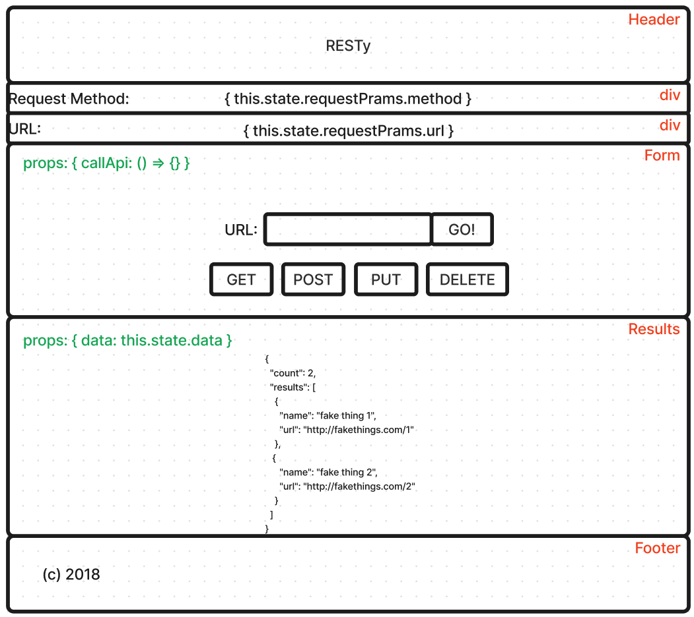

# RESTy

**Author:** Francisco Sanchez

**Version**: 1.0.0

## Overview

Project designed to reintroduce existing React concepts taught in Code 301 at Code fellows as well as become comfortable with new concepts.

## Getting Started

1. Using the terminal, navigate to a location directory of your choosing.
2. Clone [RESTy repository](https://github.com/c0d3cisco/resty) from GitHub.
3. Run `cp resty` and `npn i`
4. Run `npm start`. A browser window will open with the React app.

## Architecture

## Sandbox Code

[Sandbox React App](https://codesandbox.io/p/github/c0d3cisco/resty/main?layout=%257B%2522sidebarPanel%2522%253A%2522EXPLORER%2522%252C%2522rootPanelGroup%2522%253A%257B%2522direction%2522%253A%2522horizontal%2522%252C%2522type%2522%253A%2522PANEL_GROUP%2522%252C%2522id%2522%253A%2522ROOT_LAYOUT%2522%252C%2522panels%2522%253A%255B%257B%2522type%2522%253A%2522PANEL_GROUP%2522%252C%2522direction%2522%253A%2522horizontal%2522%252C%2522id%2522%253A%2522EDITOR%2522%252C%2522panels%2522%253A%255B%257B%2522type%2522%253A%2522PANEL%2522%252C%2522panelType%2522%253A%2522TABS%2522%252C%2522id%2522%253A%2522clj4ya2cr000b3b6npozqw7hu%2522%257D%255D%252C%2522sizes%2522%253A%255B100%255D%257D%252C%257B%2522type%2522%253A%2522PANEL_GROUP%2522%252C%2522direction%2522%253A%2522horizontal%2522%252C%2522id%2522%253A%2522DEVTOOLS%2522%252C%2522panels%2522%253A%255B%257B%2522type%2522%253A%2522PANEL%2522%252C%2522panelType%2522%253A%2522TABS%2522%252C%2522id%2522%253A%2522clj4ya2cr000d3b6ntk9f5gah%2522%257D%255D%252C%2522sizes%2522%253A%255B100%255D%257D%255D%252C%2522sizes%2522%253A%255B50%252C50%255D%257D%252C%2522tabbedPanels%2522%253A%257B%2522clj4ya2cr000b3b6npozqw7hu%2522%253A%257B%2522tabs%2522%253A%255B%257B%2522id%2522%253A%2522clj4ya2cr000a3b6n2ye068d7%2522%252C%2522mode%2522%253A%2522permanent%2522%252C%2522type%2522%253A%2522FILE%2522%252C%2522filepath%2522%253A%2522%252FREADME.md%2522%257D%255D%252C%2522id%2522%253A%2522clj4ya2cr000b3b6npozqw7hu%2522%252C%2522activeTabId%2522%253A%2522clj4ya2cr000a3b6n2ye068d7%2522%257D%252C%2522clj4ya2cr000d3b6ntk9f5gah%2522%253A%257B%2522id%2522%253A%2522clj4ya2cr000d3b6ntk9f5gah%2522%252C%2522activeTabId%2522%253A%2522clj4yarr300ct3b6np10tro4m%2522%252C%2522tabs%2522%253A%255B%257B%2522type%2522%253A%2522TASK_LOG%2522%252C%2522taskId%2522%253A%2522start%2522%252C%2522id%2522%253A%2522clj4yaogf007s3b6n8kvv82ew%2522%252C%2522mode%2522%253A%2522permanent%2522%257D%252C%257B%2522type%2522%253A%2522TASK_PORT%2522%252C%2522taskId%2522%253A%2522start%2522%252C%2522port%2522%253A3000%252C%2522id%2522%253A%2522clj4yarr300ct3b6np10tro4m%2522%252C%2522mode%2522%253A%2522permanent%2522%252C%2522path%2522%253A%2522%252F%2522%257D%255D%257D%257D%252C%2522showDevtools%2522%253Atrue%252C%2522showSidebar%2522%253Atrue%252C%2522sidebarPanelSize%2522%253A15%257D)
